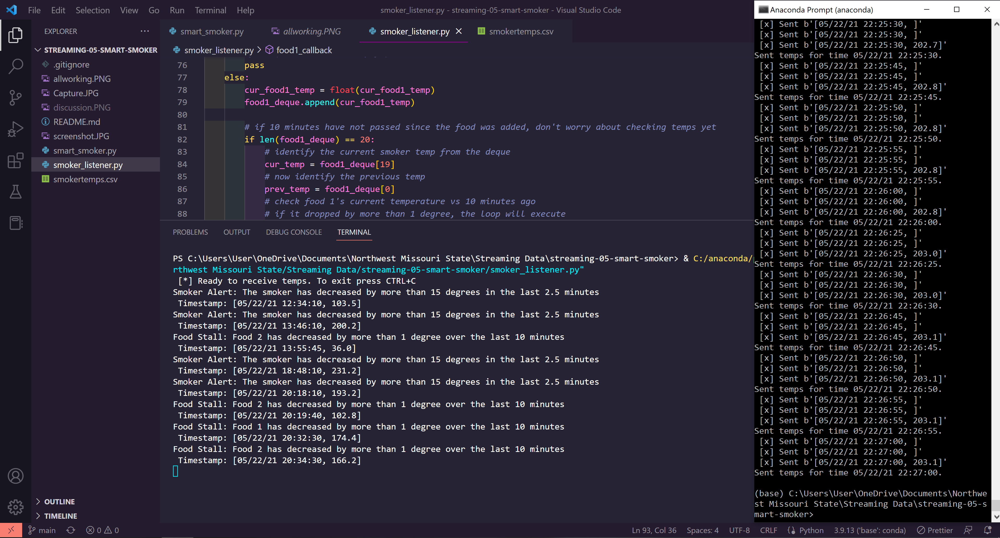

# streaming-05-smart-smoker
Work from module 5 of Streaming Data at NWMSU

> This program sends temperature readings from a smoker (csv file) to a set of queues

# Running the program
This program is designed to run without user input, as long as a properly named csv file (smokertemps.csv) is in the directory
When the program starts, it will declare queues for the smoker, food 1, and food 2.
Once it declares the queues, it reads the temperatures from the csv, and sends each of the 3 temps to its own queue to await reception by the receiver.
The receiver will take the temperatures it is sent, and check if foods or the smoker have decreased in temperature by a specific amount. If so, it will raise an alert.

## Starting Up
1. Start a terminal that can execute python scripts (such as an anaconda terminal)
2. Run smoker_listener.py (This should be done first if all readings are to be processed)
3. Run smart_smoker.py

# Using a Barbeque Smoker
When running a barbeque smoker, we monitor the temperatures of the smoker and the food to ensure everything turns out tasty. Over long cooks, the following events can happen:

1. The smoker temperature can suddenly decline.
2. The food temperature doesn't change. At some point, the food will hit a temperature where moisture evaporates. It will stay close to this temperature for an extended period of time while the moisture evaporates (much like humans sweat to regulate temperature). We say the temperature has stalled.

## Sensors
We have temperature sensors track temperatures and record them to generate a history of both (a) the smoker and (b) the food over time. These readings are an example of time-series data, and are considered streaming data or data in motion.

## Streaming Data
Our thermometer records three temperatures every thirty seconds (two readings every minute). The three temperatures are:

- the temperature of the smoker itself.
- the temperature of the first of two foods, Food A.
- the temperature for the second of two foods, Food B.
 
## Significant Events
Condition to monitor/we want to know if:

- If smoker temp decreases by 15 F or more in 2.5 min (or 5 readings)  --> smoker alert!
- If food temp change in temp is 1 F or less in 10 min (or 20 readings)  --> food stall alert!

# Screenshot of Program Running

